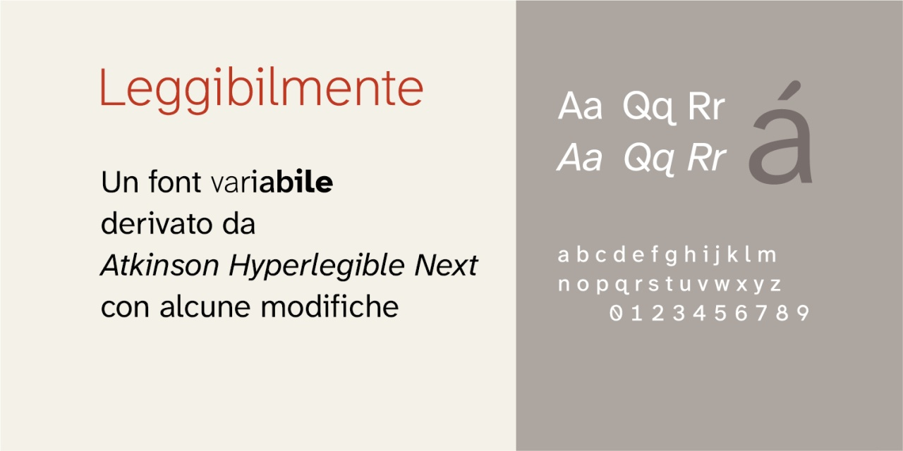
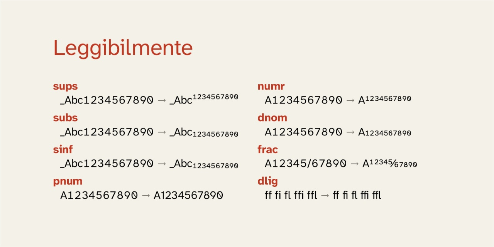

# Leggibilmente
- Versione 1.106: aggiunta di alcuni caratteri
- Versione 1.104: sistemazione di alcuni numeri
- Versione 1.101: modifica di alcune caratteristiche

Per maggiori informazioni e per testare il font, vedere la [pagina interattiva](https://m-casanova.github.io/Leggibilmente/).

## Utilizzo
Il font può essere utilizzato tramite un unico file in formato WOFF2 con il seguente codice CSS. Ovviamente il percorso del file deve essere adattato alla specifica situazione.

    @font-face {
        font-family: "Leggibilmente";
        font-weight: 200 800;
        src: url("Leggibilmente.woff2") format("woff2-variations");
    }

Per ottenere correttamente il corsivo con Chrome e Opera, utilizzare il seguente codice CSS.

    em, i { font-variation-settings: "ital" 1; font-style:normal }

## Descrizione

_Leggibilmente_ è un font variabile derivato da _[Atkinson Hyperlegible Next](https://github.com/googlefonts/atkinson-hyperlegible-next)_ (con alcune modifiche).

Il font variabile è rilasciato nei formati WOFF2 e TTF con licenza OFL 1.1.

## Opentype

